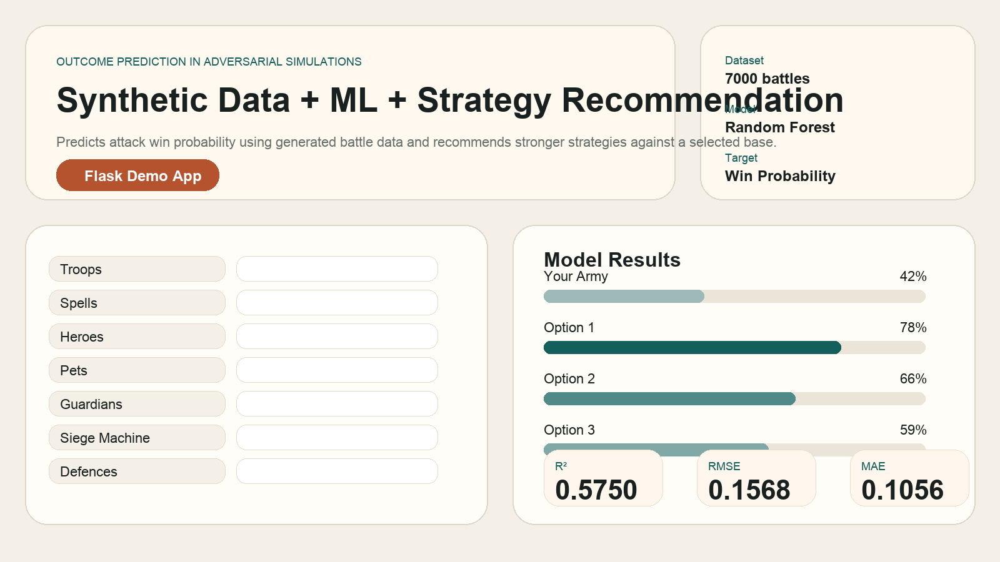

# Outcome Prediction in Adversarial Simulations using Synthetic Data Generation and ML

[](https://www.python.org/)
[](https://flask.palletsprojects.com/)
[](https://scikit-learn.org/)
[](https://github.com/Gillcharu/Outcome-Prediction-in-Adversarial-Simulations-using-Synthetic-Data-Generation-and-ML/actions)

This project predicts the probability of success in a strategy-game attack using synthetic battle simulations and machine learning. Instead of relying on real battle logs, it generates a large synthetic dataset with rule-based combat logic, trains a regression model on those simulated outcomes, and recommends stronger attacking strategies for a selected defending base.



## Overview

The project combines three connected ideas:

- synthetic data generation for adversarial simulations
- machine learning for outcome probability prediction
- brute-force recommendation for better strategy selection

This makes the project more than a basic classifier. It is a full decision-support pipeline that can estimate success and recommend what to do next.

## Why this project is strong

- It predicts a probability instead of only returning `win` or `lose`.
- It creates its own dataset through rule-based synthetic simulation.
- It supports a large feature space across attack and defense composition.
- It uses a trained ML model and a recommendation layer on top.
- It includes a web app and API, making it easy to demonstrate.

## Problem statement

Real battle data is not always available for strategy-game research projects. To solve that, this project simulates battles using domain-inspired rules such as:

- air-heavy armies struggle against strong anti-air defenses
- ground pushes are affected by walls, infernos, and splash structures
- siege machines and clan castle choices change matchup quality
- spells, heroes, pets, and guardians influence style-specific effectiveness

These simulations are used to build a supervised learning dataset with `win_probability` as the target.

## System workflow

```text
Attack Input + Base Input
        ->
Synthetic Battle Simulation
        ->
Generated Dataset
        ->
Random Forest Regression Model
        ->
Win Probability Prediction
        ->
Brute-Force Strategy Recommendation
```

## Features

- Synthetic battle generation using rule-based combat logic
- Probability prediction with `RandomForestRegressor`
- Detailed attack-side feature support
- Detailed defense-side feature support
- Web interface for prediction and strategy comparison
- JSON API for programmatic access
- Candidate search for top attacking strategies

## Inputs modeled

### Attack-side inputs

#### Troops

- Barbarian
- Archer
- Wizard
- Goblin
- Giant
- Wall Breaker
- Balloon
- Healer
- Dragon
- P.E.K.K.A
- Baby Dragon
- Miner
- Electro Dragon
- Yeti
- Dragon Rider
- Electro Titan
- Root Rider
- Thrower
- Meteor Golem
- Minion
- Hog Rider
- Valkyrie
- Golem
- Witch
- Lava Hound
- Bowler
- Ice Golem
- Apprentice Warden
- Headhunter
- Druid
- Furnace

#### Spells

- Lightning
- Heal
- Rage
- Jump
- Freeze
- Clone
- Invisibility
- Recall
- Revive
- Totem
- Poison
- Earthquake
- Haste
- Skeleton
- Bat
- Overgrowth
- Ice Block

#### Heroes

- Barbarian King
- Archer Queen
- Minion Prince
- Grand Warden
- Royal Champion
- Dragon Duke

#### Pets

- L.A.S.S.I
- Electro Owl
- Mighty Yak
- Unicorn

#### Guardians

- Ground Guardian
- Air Guardian
- Healing Guardian

#### Other attack settings

- Clan Castle
- Siege Machine

### Defense-side inputs

- Base Level
- Cannon
- Archer Tower
- Wall
- Mortar
- Air Defence
- Wizard Tower
- Air Sweeper
- Hidden Tesla
- Bomb Tower
- X-Bow
- Inferno Tower
- Eagle Artillery
- Scattershot
- Spell Tower
- Monolith
- Traps

## Machine learning pipeline

1. Generate thousands of synthetic battles.
2. Convert attack and defense configurations into tabular features.
3. Train a `RandomForestRegressor` to predict `win_probability`.
4. Score a user-selected army against a target base.
5. Search candidate strategies and rank the strongest options.

## Project structure

- `battle_simulator.py`  
  Synthetic data generation, schema definitions, and battle scoring logic.

- `train_model.py`  
  Dataset creation, model training, evaluation, and artifact generation.

- `recommend_strategy.py`  
  Candidate search and ranking for recommended attacking strategies.

- `app.py`  
  Flask application for the website and API.

- `templates/index.html`  
  Frontend structure for the web interface.

- `static/style.css`  
  UI styling.

- `static/app.js`  
  Frontend interactions and chart rendering.

- `tests/test_app.py`  
  Basic application tests.

## Dataset

The dataset is generated locally by running `python3 train_model.py`.

It contains:

- attack composition features
- detailed defense structure features
- aggregate defense pressure features
- `win_probability` as the target variable

Current dataset summary:

- `7000` simulated battles
- `86` total columns
- target column: `win_probability`

## Model and evaluation

The project uses a `RandomForestRegressor` to estimate battle success probability.

Current held-out test results:

- `MAE = 0.1056`
- `RMSE = 0.1568`
- `R² = 0.5750`

The trained model artifact is generated locally when you run `python3 train_model.py`.

## Website

The web app allows you to:

- enter army and defense values manually
- use base presets for quick testing
- estimate the probability of success for a chosen attack
- compare your current army with stronger recommended strategies
- inspect structured summaries of selected attack and defense inputs

## Screenshots and preview

The repo includes a visual project preview:

- `docs/images/project-preview.png`

For a stronger professor-facing submission, you can later add real browser screenshots of:

- the attack/base input form
- the recommendation and results panel

Local URL:

- [http://127.0.0.1:5000](http://127.0.0.1:5000)

## API

Endpoints:

- `GET /health`
- `POST /api/predict`

Example:

```bash
curl -X POST http://127.0.0.1:5000/api/predict \
  -H "Content-Type: application/json" \
  -d '{"troop_barbarian":10,"troop_archer":12,"spell_rage":2,"hero_barbarian_king":80,"defense_cannon":5,"defense_air_defence":7,"base_level":15,"clan_castle":"cc_yeti","siege_machine":"log_launcher"}'
```

## GitHub repository settings

Suggested repository description:

`ML project for predicting attack outcomes using synthetic data generation, Random Forest regression, and strategy recommendation.`

Suggested topics:

- `machine-learning`
- `python`
- `flask`
- `random-forest`
- `scikit-learn`
- `synthetic-data`
- `simulation`
- `predictive-modeling`
- `web-app`

## Setup

```bash
git clone https://github.com/Gillcharu/Outcome-Prediction-in-Adversarial-Simulations-using-Synthetic-Data-Generation-and-ML.git
cd Outcome-Prediction-in-Adversarial-Simulations-using-Synthetic-Data-Generation-and-ML
python3 -m venv .venv
source .venv/bin/activate
pip install -r requirements.txt
```

## Run locally

Train the model and generate the dataset:

```bash
python3 train_model.py
```

Start the app:

```bash
python3 app.py
```

Run tests:

```bash
python3 -m unittest discover -s tests
```

## Deployment

The repository already includes:

- `Dockerfile`
- `Procfile`
- `gunicorn`

Example Docker usage:

```bash
docker build -t attack-predictor .
docker run -p 5000:5000 attack-predictor
```

## GitHub polish checklist

- README with clear project framing
- CI workflow for test execution
- issue templates
- contributing guide
- license
- profile README template

## Future improvements

- stronger simulation rules with more game-specific mechanics
- larger candidate search space for recommendations
- feature importance or model explainability views
- grouped defense filters in the UI
- deployed public demo
